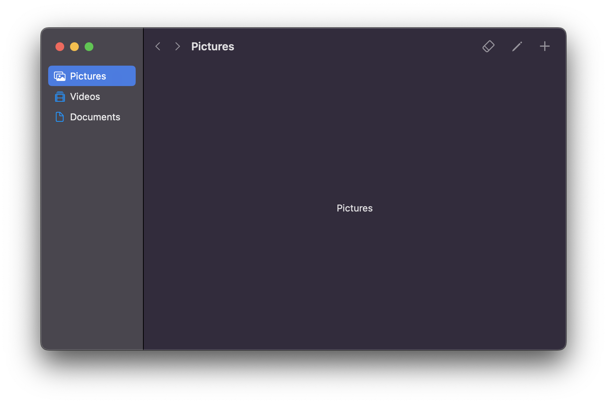

# swiftui-advanced-toolbar-app

An example implementation of `NSWindow` with advanced toolbar capabilities in a SwiftUI-based macOS application.

<p align="center"></p>

## Why?

Because window management for macOS apps using SwiftUI's lifecycle is goofy, and I'm not using this ridiculous workaround in my app:

```swift
@main
struct MyApplication: App {
    var body : some Scene {
        Window("Some Window", id: "some-window") {
            ContentView().background(WindowAccessor())
        }
    }
}

struct WindowAccessor: NSViewRepresentable {
    func makeNSView(context: Context) -> NSView {
        let view = NSView()
        DispatchQueue.main.async {
            view.window?.titlebarAppearsTransparent = true
        }
        return view;
    }

    func updateNSView(_ nsView: NSView, context: Context) { }
}
```

Until Apple starts paying some level of serious attention to SwiftUI's implementation on macOS, I'll continue to use `NSWindow`.

## License

MIT
